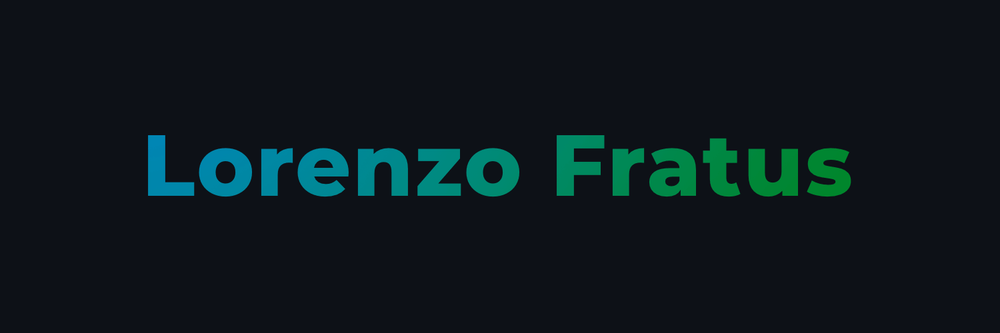

[](https://www.lorenzofratus.it/)

# Hi, there! ✌️

## 👨‍💻 Anything you need to know about me...

```javascript
const myself = {
    firstName: 'Lorenzo',
    lastName: 'Fratus',
    country: 'Italy',
    contact: 'info@lorenzofratus.it',
    status: {
        main: 'College student',
        occasional: 'Web developer',
    },
    education: () => {
        const expectedGraduation = new Date(2022, 7, 0);
        return Date.now() < expectedGraduation
            ? {
                major: 'Computer Science',
                degree: 'Ingegneria Informatica',
                level: 'Bachelor',
                university: 'Politecnico di Milano'
            }
            : {
                major: 'Computer Science',
                degree: 'Computer Science and Engineering',
                level: 'Master',
                university: 'Politecnico di Milano'
            }
    },
    languages: {
        favorite: 'JavaScript',
        oftenUsed: [
            'Java',
            'Dart',
            'HTML',
            'CSS'
        ],
        occasional: 'C'
    },
    tools: [
        'NodeJS',
        'ExpressJS',
        'MySQL',
        'Flutter',
        'Wordpress',
        'Adobe suite'
    ]
}
```
